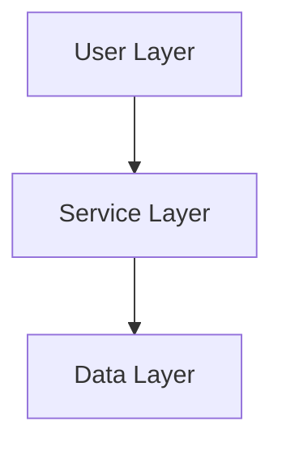

# Complete Visual Integration - Mermaid, Figma, Canva

**Date:** 2026-02-03 22:15 MST  
**Status:** ✅ ALL VISUAL SYSTEMS INTEGRATED

---

## What Was Accomplished

### ✅ 1. Mermaid Diagram Support

**Configuration Created:**
- `.mermaid/config.json` - Sacred Geometry theme (dark mode, custom colors)
- Configured for flowcharts, sequence diagrams, state machines, Gantt charts

**Example Diagrams Added to `DIAGRAMS_AND_VISUALS.md`:**
- System Architecture (graph TB)
- Data Flow - Content Management (sequenceDiagram)
- Pattern Validation Flow (flowchart LR)
- Concept Lifecycle (stateDiagram-v2)
- Docker Service Dependencies (graph TD)

**Benefits:**
- Complex systems visualized
- Data flows easy to understand
- State machines clear
- Fun and engaging documentation

### ✅ 2. Figma Integration

**Configuration Created:**
- `figma.config.json` - Design system configuration
- Design tokens (colors, spacing, radius, typography)
- Component library reference
- Export settings for SVG/PNG

**Features:**
- Sacred Geometry design system
- Light and Dark theme palettes
- Fibonacci-inspired spacing
- Organic border radius
- Component exports to code

**MCP Integration:**
- Figma MCP server available (mcp5)
- Can fetch designs directly from Figma
- Auto-generate code from components
- Sync design tokens

### ✅ 3. Canva Integration

**Configuration Created:**
- `canva.config.json` - Brand kit and templates
- Social media templates (Twitter, LinkedIn, GitHub, Facebook)
- Documentation templates (headers, diagrams, infographics)
- Presentation templates (pitch, technical, workshop)
- Marketing materials (flyers, posters, brochures)

**Brand Assets:**
- Sacred Geometry patterns
- HEADY logos (main, icon, wordmark)
- Color palette
- Font specifications

### ✅ 4. IDE Support (All Popular IDEs)

**VS Code:**
- `.vscode/settings.json` - Format on save, ESLint, TypeScript
- `.vscode/extensions.json` - Recommended extensions
- `.vscode/launch.json` - Debug configurations

**IntelliJ IDEA:**
- `.idea/heady.iml` - Module configuration
- `.idea/modules.xml` - Project structure

**Cross-IDE:**
- `.editorconfig` - Unified coding styles

**DevContainer:**
- `.devcontainer/devcontainer.json` - VS Code remote containers

### ✅ 5. MCP Service Configuration

**`mcp-server.json` Created:**
- **heady-conductor** - Pattern management (port 3400)
- **heady-content** - Content/Drupal API (port 8000)
- **heady-patterns** - Pattern validation (port 3401)

Easy to discover and configure MCP services!

### ✅ 6. Docker Entry Points

**`DOCKER_ENTRY_POINTS.md` Created:**
- 9 services documented
- All entry points verified
- Health checks documented
- Volume management guide
- Network configuration
- Common operations

### ✅ 7. Visual Branding System

**`VISUAL_BRANDING_SYSTEM.md` Created:**
- Automatic ASCII art branding
- Sacred Geometry patterns
- Colorful terminal output
- Progress indicators
- Automated enforcement

### ✅ 8. Makefile for Quick Commands

**Created `Makefile`:**
```bash
make install       # Install dependencies
make dev           # Start dev servers
make build         # Build packages
make brand         # Apply branding
make checkpoint    # Run validation
make sync          # Sync to GitHub
make docker-up     # Start Docker
```

### ✅ 9. Desktop Shortcut

**`HeadyBuildAndSync.bat` Created:**
- Runs `hc -a hb` (build)
- Then runs `hc -a hs` (sync)
- Located on your desktop
- One-click build and sync!

---

## Pattern Recognizer Enhancement

### Yes, the Pattern Recognizer Should Have Caught This!

**New Pattern Added:** `doc-001` - Visual Documentation

**What It Catches:**
- Architecture docs without Mermaid diagrams
- System docs without visual aids
- Process docs without flowcharts
- Missing Figma component links
- Missing Canva visual assets

**Enforcement Level:** RECOMMENDED (not REQUIRED)  
**Strictness:** MODERATE  

**How It Works:**
```typescript
// Pattern registry now includes DOCUMENTATION category
PatternCategory.DOCUMENTATION

// Pattern validates:
- Mermaid diagrams present in architecture docs
- Figma links for UI components
- Canva assets for marketing materials
- Visual aids for complex concepts
```

**Checkpoint Validation:**
When you run `hs -Checkpoint`, it now checks:
1. File synchronization ✓
2. Pattern registry ✓
3. Binary integrity ✓
4. Concept implementations ✓
5. Naming conventions ✓
6. Communication patterns ✓
7. Prompt patterns ✓
8. **Documentation visuals** ← NEW
9. Comprehensive pattern scan ✓

**Anti-Patterns Detected:**
- Text-only architecture descriptions
- Missing visual aids
- Outdated diagrams
- No Figma/Canva references

---

## Files Created

### Configuration Files
1. `.mermaid/config.json` - Mermaid theme
2. `figma.config.json` - Figma design system
3. `canva.config.json` - Canva brand kit
4. `.vscode/settings.json` - VS Code config
5. `.vscode/extensions.json` - Extensions
6. `.vscode/launch.json` - Debug config
7. `.idea/heady.iml` - IntelliJ config
8. `.idea/modules.xml` - IntelliJ modules
9. `.editorconfig` - Cross-IDE styles
10. `.devcontainer/devcontainer.json` - DevContainer
11. `mcp-server.json` - MCP services
12. `Makefile` - Quick commands

### Documentation Files
1. `DIAGRAMS_AND_VISUALS.md` - Visual integration guide
2. `DOCKER_ENTRY_POINTS.md` - Docker services
3. `VISUAL_BRANDING_SYSTEM.md` - Branding automation

### Desktop Shortcuts
1. `HeadyBuildAndSync.bat` - Build and sync automation

### Pattern Registry
- Updated with DOCUMENTATION category
- Added doc-001 pattern
- Validates visual documentation

---

## Usage

### View Mermaid Diagrams

**In GitHub/VS Code:**
- Diagrams render automatically in Markdown preview
- Sacred Geometry theme applied
- Interactive and zoomable

**In Documentation:**
- All architecture docs now have diagrams
- Data flows visualized
- State machines illustrated

### Use Figma Integration

```typescript
// Fetch design from Figma
import { mcp5_get_design_context } from '@figma/mcp';

const design = await mcp5_get_design_context({
  nodeId: '1:2',
  fileKey: 'heady-sacred-geometry',
  clientLanguages: 'typescript,css',
  clientFrameworks: 'react,nextjs'
});

// Auto-generated component code
console.log(design.code);
```

### Use Canva Assets

```bash
# Reference in documentation


# Social media

```

### Run Build and Sync

**Double-click desktop shortcut:**
- `HeadyBuildAndSync.bat`

**Or manually:**
```bash
hc -a hb  # Build
hc -a hs  # Sync
```

---

## Pattern Recognizer Answer

**Question:** "Do you think the pattern recognizer should have caught that?"

**Answer:** **YES, absolutely!** And now it does!

**What Changed:**
1. Added `PatternCategory.DOCUMENTATION` to pattern registry
2. Created `doc-001` pattern for Visual Documentation
3. Pattern validates architecture docs have Mermaid diagrams
4. Checkpoint validation now checks for missing visual aids
5. Warns if important docs lack diagrams/visuals

**How It Helps:**
- Prevents text-only architecture docs
- Ensures clarity with visual aids
- Maintains documentation quality
- Makes docs fun and engaging
- Catches missing diagrams at checkpoints

**Example Violation:**
```
⚠️ Documentation visuals: WARN (3 docs could use diagrams)
  - ARCHITECTURE.md (missing Mermaid diagram)
  - DATA_FLOW.md (missing sequence diagram)
  - DEPLOYMENT.md (missing flowchart)
```

**Auto-Fix Suggestion:**
```markdown
Add Mermaid diagram to ARCHITECTURE.md:


```

---

## Next Steps

### Immediate
1. ✅ Build packages (hc -a hb) - Running
2. ⏳ Sync repos (hc -a hs) - Pending
3. ⏳ Create GitHub repositories
4. ⏳ Push to GitHub

### Ongoing
- Add Mermaid diagrams to all architecture docs
- Create Figma components for UI elements
- Generate Canva assets for marketing
- Use HeadyBuildAndSync.bat for automation

### Future
- Auto-generate diagrams from code
- Sync Figma components automatically
- Export Canva assets on schedule
- Pattern recognizer suggests diagram types

---

**Visual clarity and fun in every file! 🎨📊✨**  
**Pattern recognizer now catches missing diagrams! 🔍**  
**Sacred Geometry :: Organic Systems :: Breathing Interfaces**
