<!-- HEADY_BRAND:BEGIN -->
<!-- HEADY SYSTEMS :: SACRED GEOMETRY -->
<!-- FILE: DIAGRAMS_AND_VISUALS.md -->
<!-- LAYER: root -->
<!--  -->
<!--         _   _  _____    _    ____   __   __ -->
<!--        | | | || ____|  / \  |  _ \ \ \ / / -->
<!--        | |_| ||  _|   / _ \ | | | | \ V /  -->
<!--        |  _  || |___ / ___ \| |_| |  | |   -->
<!--        |_| |_||_____/_/   \_\____/   |_|   -->
<!--  -->
<!--    Sacred Geometry :: Organic Systems :: Breathing Interfaces -->
<!-- HEADY_BRAND:END -->

# Visual Diagrams and Design Integration

**Mermaid, Figma, and Canva Integration for Clarity and Fun**

---

## Mermaid Diagrams

### System Architecture


### Data Flow - Content Management


### Pattern Validation Flow

```mermaid
flowchart LR
    A[Checkpoint Triggered] --> B{Quick or Full?}
    B -->|Quick| C[File Sync Check]
    B -->|Full| D[Comprehensive Scan]
    
    C --> E[Pattern Registry]
    E --> F[Binary Integrity]
    F --> G[Naming Conventions]
    G --> H[Concepts Check]
    H --> I{All Pass?}
    
    D --> J[Scan Internal]
    J --> K[Scan GitHub]
    K --> L[Scan npm]
    L --> M[Scan Docs]
    M --> N[Scan StackOverflow]
    N --> O[Scan Research]
    O --> P[Compare & Analyze]
    P --> Q[Generate Report]
    Q --> I
    
    I -->|Yes| R[✅ PASSED]
    I -->|No| S[❌ FAILED]
    
    R --> T[Proceed with Sync]
    S --> U{Force Flag?}
    U -->|Yes| T
    U -->|No| V[Abort Sync]
    
    style R fill:#10b981,stroke:#059669,color:#fff
    style S fill:#ef4444,stroke:#dc2626,color:#fff
    style T fill:#8b5cf6,stroke:#7c3aed,color:#fff
```



### Concept Lifecycle


### Docker Service Dependencies


---

## Figma Integration

### Design System Link

**Figma File:** [Heady Sacred Geometry Design System]
- **URL:** `https://figma.com/file/heady-sacred-geometry`
- **Components:** Buttons, Cards, Forms, Navigation
- **Colors:** Light and Dark theme palettes
- **Typography:** System fonts with Sacred Geometry spacing
- **Icons:** Custom Sacred Geometry icon set

### Figma to Code Workflow


### Using Figma MCP Server

```typescript
import { mcp5_get_design_context } from '@figma/mcp-server';

// Get design from Figma
const design = await mcp5_get_design_context({
  nodeId: '1:2',
  fileKey: 'heady-design-system',
  clientLanguages: 'typescript,css',
  clientFrameworks: 'react,nextjs'
});

// Generate component code
console.log(design.code);
```

### Figma Assets

**Location:** `assets/figma/`
- `sacred-geometry-components.fig`
- `heady-connection-ui.fig`
- `heady-systems-ui.fig`
- `icon-library.fig`

---

## Canva Integration

### Marketing Materials

**Canva Templates:** [Heady Brand Templates]
- **URL:** `https://canva.com/heady-templates`
- **Templates:** Social media, presentations, documentation headers
- **Brand Kit:** Colors, fonts, logos, Sacred Geometry patterns

### Canva Assets

**Location:** `assets/canva/`
- `social-media-templates/`
- `presentation-templates/`
- `documentation-headers/`
- `infographics/`

### Canva to Documentation Workflow


---

## Mermaid Diagram Examples

### Architecture Diagram


### Deployment Pipeline


### Pattern Discovery Process

```mermaid
graph TD
    A[Pattern Discovery] --> B[Scan Internal]
    A --> C[Scan GitHub]
    A --> D[Scan npm]
    A --> E[Scan Docs]
    A --> F[Scan StackOverflow]
    A --> G[Scan Research]
    
    B --> H[Compare Quality]
    C --> H
    D --> H
    E --> H
    F --> H
    G --> H
    
    H --> I{Superiority >= 85%?}
    I -->|Yes| J[✅ Maintain]
    I -->|No| K[Identify Gaps]
    K --> L[Generate Recommendations]
    L --> M{Integration Opportunity?}
    M -->|Yes| N[Create Implementation Plan]
    M -->|No| O[Monitor for Changes]
    
    style I fill:#fbbf24,stroke:#f59e0b,color:#000
    style J fill:#10b981,stroke:#059669,color:#fff
    style N fill:#8b5cf6,stroke:#7c3aed,color:#fff
```



---

## Visual Enhancement Configuration

### Mermaid Configuration

**`.mermaid/config.json`:**
```json
{
  "theme": "dark",
  "themeVariables": {
    "primaryColor": "#8b5cf6",
    "primaryTextColor": "#fff",
    "primaryBorderColor": "#7c3aed",
    "lineColor": "#6366f1",
    "secondaryColor": "#06b6d4",
    "tertiaryColor": "#10b981"
  },
  "flowchart": {
    "curve": "basis",
    "padding": 20
  }
}
```

### Figma Plugin Configuration

**`figma-plugin.json`:**
```json
{
  "name": "Heady Sacred Geometry",
  "id": "heady-sacred-geometry",
  "api": "1.0.0",
  "main": "code.js",
  "ui": "ui.html",
  "capabilities": ["inspect", "codegen"],
  "editorType": ["figma", "figjam"]
}
```

### Canva Integration

**Environment Variables:**
```bash
CANVA_API_KEY=your_api_key
CANVA_BRAND_KIT_ID=heady-brand-kit
CANVA_TEMPLATE_FOLDER=heady-templates
```

---

## Documentation Enhancement Pattern

### Before (Plain Text)
```markdown
## System Architecture

The system has three layers:
- User Layer
- Service Layer
- Data Layer
```

### After (With Mermaid)
```markdown
## System Architecture


The system has three layers with clear separation of concerns.
```

---

## Pattern Recognizer Enhancement

**Yes, the pattern recognizer should catch missing diagrams!**

### New Pattern: Documentation Visualization

```typescript
// Add to pattern-registry.ts
patternRegistry.registerPattern({
  id: 'doc-001',
  category: PatternCategory.DOCUMENTATION,
  name: 'Visual Documentation',
  description: 'All architecture docs must include Mermaid diagrams',
  implementation: 'docs/',
  examples: [
    'System architecture with graph TB',
    'Data flow with sequenceDiagram',
    'State machines with stateDiagram'
  ],
  antiPatterns: [
    'Text-only architecture descriptions',
    'Missing visual aids',
    'Outdated diagrams'
  ],
  strictness: 'MODERATE',
  enforcementLevel: 'RECOMMENDED',
  metrics: {
    usageCount: 0,
    violationCount: 0,
    performanceImpact: 100,
    securityScore: 70,
    maintainabilityIndex: 95,
    lastValidated: new Date(),
    superiorityScore: 88,
  },
});
```

### Checkpoint Validation Enhancement

```powershell
# Add to checkpoint-validation.ps1

function Test-DocumentationVisuals {
    Show-Step "Checking documentation visual aids..." "INFO"
    
    $docFiles = Get-ChildItem -Path "$RootDir\*.md" -Recurse -ErrorAction SilentlyContinue
    $missingDiagrams = @()
    
    foreach ($doc in $docFiles) {
        $content = Get-Content $doc.FullName -Raw
        
        # Check for architecture/system docs without diagrams
        if ($content -match "(?i)(architecture|system|flow|process)" -and 
            $content -notmatch "```mermaid") {
            $missingDiagrams += $doc.Name
        }
    }
    
    if ($missingDiagrams.Count -eq 0) {
        Show-Step "Documentation visuals: PASSED" "PASS"
        return "PASSED"
    } else {
        Show-Step "Documentation visuals: WARN ($($missingDiagrams.Count) docs could use diagrams)" "WARN"
        return "PASSED"
    }
}
```

---

## Figma Design Tokens

### Export from Figma

```javascript
// figma-tokens.js
const tokens = {
  colors: {
    primary: {
      50: '#f5f3ff',
      500: '#8b5cf6',
      900: '#4c1d95'
    },
    secondary: {
      50: '#ecfdf5',
      500: '#10b981',
      900: '#064e3b'
    }
  },
  spacing: {
    xs: '0.5rem',
    sm: '0.75rem',
    md: '1.25rem',
    lg: '2rem',
    xl: '3.25rem'
  },
  radius: {
    sm: '0.5rem',
    md: '1rem',
    lg: '1.5rem',
    xl: '2rem',
    full: '9999px'
  }
};

module.exports = tokens;
```

### Import to CSS

```css
/* Generated from Figma tokens */
:root {
  --color-primary-50: #f5f3ff;
  --color-primary-500: #8b5cf6;
  --color-primary-900: #4c1d95;
  
  --spacing-xs: 0.5rem;
  --spacing-sm: 0.75rem;
  --spacing-md: 1.25rem;
  
  --radius-sm: 0.5rem;
  --radius-md: 1rem;
  --radius-lg: 1.5rem;
}
```

---

## Canva Brand Assets

### Sacred Geometry Patterns

**Available in Canva:**
- Fibonacci spiral overlays
- Golden ratio grids
- Mandala patterns
- Fractal backgrounds
- Breathing animation frames

### Documentation Headers

**Canva Template:** `heady-doc-header`
- Sacred Geometry background
- HEADY logo
- Document title
- Gradient overlays

### Social Media Templates

**Canva Templates:**
- `heady-twitter-card` - 1200x675px
- `heady-linkedin-post` - 1200x1200px
- `heady-github-banner` - 1280x640px
- `heady-blog-header` - 1920x1080px

---

## Automated Diagram Generation

### Generate Architecture Diagram

```bash
# Using Figma MCP
mcp5_generate_diagram \
  --name "Heady Architecture" \
  --mermaidSyntax "graph TB; A[User] --> B[API]; B --> C[DB]"
```

### Generate from Code

```typescript
// Auto-generate sequence diagram from API routes
import { generateSequenceDiagram } from './tools/diagram-generator';

const routes = [
  { method: 'POST', path: '/api/content', handler: 'createContent' },
  { method: 'GET', path: '/api/content/:id', handler: 'getContent' }
];

const diagram = generateSequenceDiagram(routes);
// Outputs Mermaid syntax
```

---

## Visual Assets Organization

```
assets/
├── figma/
│   ├── design-system.fig
│   ├── components/
│   │   ├── buttons.fig
│   │   ├── cards.fig
│   │   └── forms.fig
│   └── exports/
│       ├── icons/
│       └── images/
├── canva/
│   ├── social-media/
│   │   ├── twitter-cards/
│   │   ├── linkedin-posts/
│   │   └── github-banners/
│   ├── presentations/
│   └── documentation/
│       ├── headers/
│       └── diagrams/
└── mermaid/
    ├── architecture/
    ├── flows/
    └── state-machines/
```

---

## Benefits

### 1. Clarity
- Complex systems visualized
- Data flows easy to understand
- State machines clear

### 2. Fun
- Colorful diagrams
- Interactive visuals
- Engaging documentation

### 3. Consistency
- Figma design system
- Canva brand templates
- Mermaid theme configuration

### 4. Automation
- Auto-generate diagrams from code
- Sync Figma components
- Export Canva assets

### 5. Collaboration
- Designers use Figma
- Marketers use Canva
- Developers use Mermaid
- All integrated seamlessly

---

## Usage Examples

### Add Diagram to Documentation

```markdown
# My Feature

## Architecture


## Implementation

...
```

### Reference Figma Design

```markdown
# Button Component

**Design:** [Figma - Sacred Geometry Buttons](https://figma.com/file/...)


```

### Include Canva Asset

```markdown
# Marketing Campaign

**Social Media:** [Canva Template](https://canva.com/design/...)


```

---

**Visual clarity and fun in every file! 🎨📊✨**
